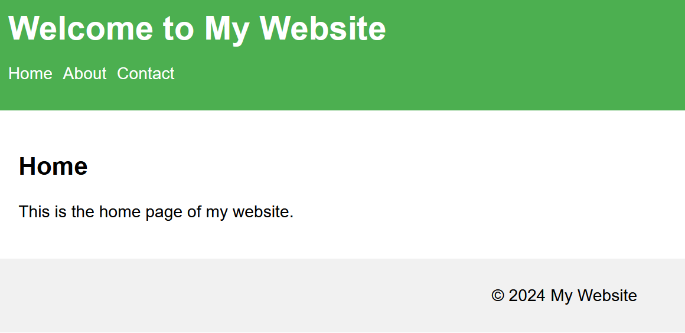
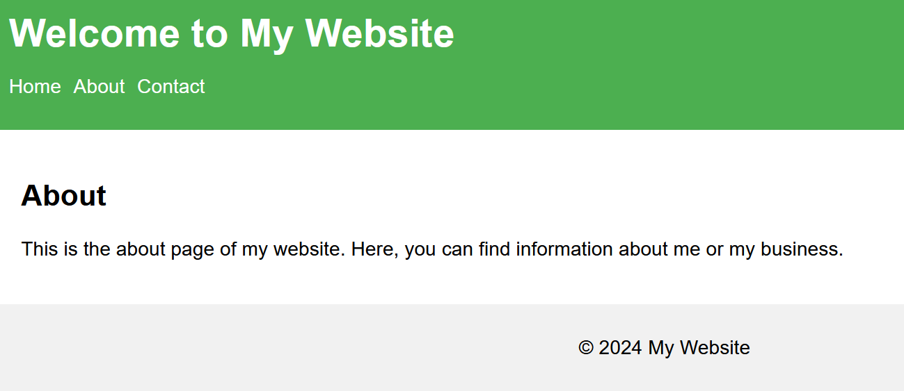
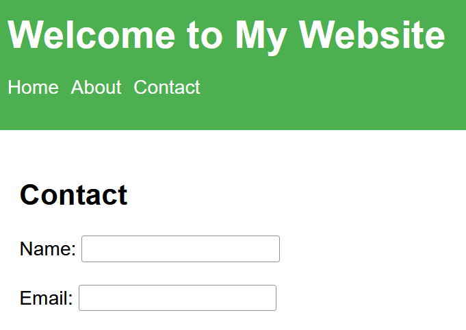

# Full-Fledged Webpage Example

This repository contains a simple example of a fully functional webpage with navigation between Home, About, and Contact pages.

## Screenshots
### Home Page

### About Page

### Contact Page

## Features
- Navigation bar with links to Home, About, and Contact pages
- Basic HTML and CSS design
- Simple contact form with name and email fields

## Usage
- Click on the navigation links to move between pages.
- Fill out the contact form and submit (Note: This is a static example, so the form does not process submissions).

## Live Demo
You can view the live version of this project here: [Live Demo](https://rawcdn.githack.com/KLubina/full-fledged-webpage-example/74a22fd22ce785780eda03099a0a8951bf907ec8/index.html)

## Author
[KLubina](https://github.com/KLubina)

